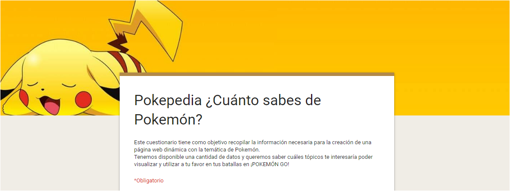
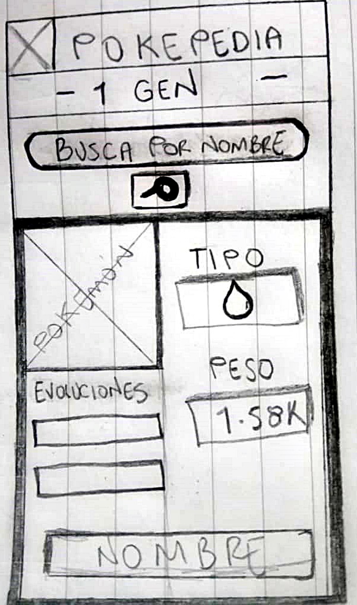
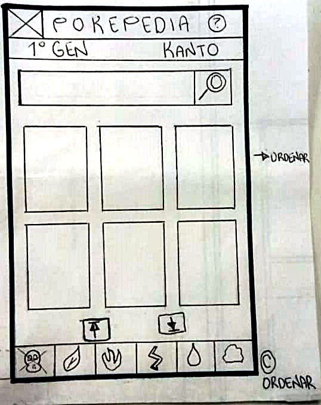
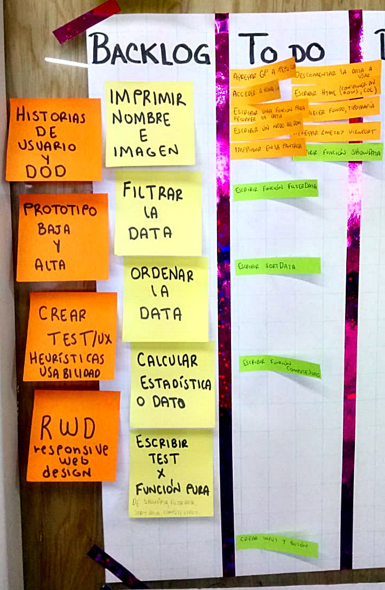
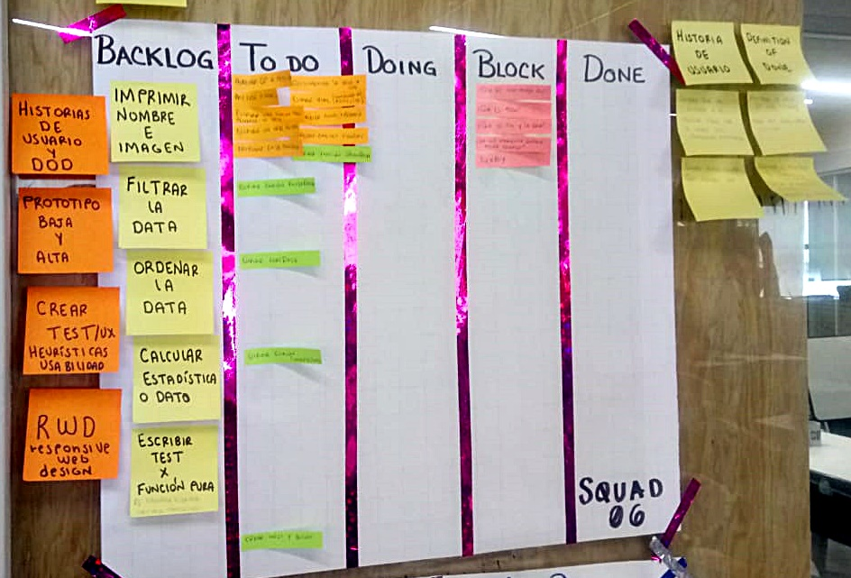

# POKEPEDIA

## Te enseñamos datos que ni te imaginabas de los pokemones. 

- [Definición del producto](##Definición-del-producto)
- [Resumen](#resumen-del-proyecto)
- [Consideraciones generales](#consideraciones-generales)
- [Consideraciones técnicas](#consideraciones-técnicas)
- [Contenido de referencia](#contenido-de-referencia)
- [Checklist](#checklist)
---

# Definición del producto

## Diseño de experiencia de usuario (User Experience Design)

- Investigación con usuarios / entrevistas

    - ¿Quiénes son los principales usuarios de producto?

    - ¿Cuáles son los objetivos de estos usuarios en relación con el producto?

    - ¿Cuáles son los datos más relevantes que quieren ver en la interfaz y por qué?

    - ¿Cuándo utilizan o utilizarían el producto?

- Historias de usuario

1. Como usuario, quiero visualizar a todos los pokemones disponibles en cards.
  * _Definition Of Done_ (DOD).

    - Cuando el usuario acceda al producto, debe poder visualizar todas las tarjetas con la información básica de cada pokemón, si clickea estas cards, debe acceder a datos aún mas complejos.

2.
3.
4.

- Principios de diseño visual

    -  Fué importante que la interfaz a pesar de ser una versión mínima de nuestro ideal,
    siga los fundamentos de _visual design_.

---
# Resumen del proyecto

NOTA: DESARROLLAR LA TEMÁTICA Y POR QUÉ LA ELEGIMOS, BASADA EN LO ANTERIOR

Una vez que definas tu área de interés, entiende quién es tu usuario y qué
necesita saber o ver exactamente; luego podrás construir la interfaz que le
ayude a interactuar y entender mejor esos datos.

* Investigación

  * [Cuestionario](https://forms.gle/EhS3LLSUzr2ZHaF2A)

   

## Ideación
1. Diseño de la Interfaz de Usuario

-   Prototipo de baja fidelidad
      * Prototipo 1.1
    
      

      Card completa

      

      

      * Prototipo 1.2

      Durante la segunda iteración (Segundo sprint), después del feedback recibido, se añadieron a UI otras características.

      1. HOME PAGE

      

      2. CARDS DE LA BUSQUEDA

      

      3. CARDS CUANDO SE ORDENA POR TIPO

      

      4. CARD PRINCIPAL, MUESTRA DATOS ESTADISTICOS

      

-   Prototipo de alta fidelidad
    * PENDIENTE
-   Testeos de usabilidad
    * [DEMO](https://marvelapp.com/62679bi/screen/58843258) con Marvel
    * Entrevistas
    
-   Implementación de la Interfaz de Usuario (HTML/CSS/JS)
    * 
---
# Consideraciones generales

- Este proyecto se resolvió en dupla.
  - Integrantes:

    * Minerva Meza Maldonado.
    * Leticia Vianey Lara Rangel.

- Tiempo para completarlo: Fueron 3 semanas divididas en 3 sprints (una entrega del producto funcional al término de cada sprint).

  ### Instalación
   - ¿Cómo visualizo el producto final?

   La demo del producto está disponible gracias al host de GitHub Pages.
   
  Puedes acceder dando click al enlace que se encuentra en la cabecera de este repositorio y/o dando click [aquí DEMO](https://vianeylararangel.github.io/MEX-Data-Lovers-008/src/index.html).

---
## Detalles del proyecto

- Metodología:
  
  Fué usado el método **Ágile** por medio de tablero **Kanban en papel** para ser usado por el  _SQUAD_ de trabajo y con _TRELLO_ para el tablero **Kanban digital** que usamos en dupla en el desarrollo del proyecto.

  

  

- Herramientas:

  * GitHub y GitHub Pages: Control de versiones y hosting.
  * Trello: Organización y gestión de tareas.
  * Figma: Prototipo de alta fidelidad.
  * Marvel: Demo de prototipos de baja fidelidad (sketch).
  * Editor de texto: Visual Studio Code.

## Hacker edition
PENDIENTE

NOTA: CREAR UNA CARPETA Y LINKEAR ESTA INFORMACION.

### Herramientas

- [Git](https://git-scm.com/)
- [GitHub](https://github.com/)
- [GitHub Pages](https://pages.github.com/)
- [Node.js](https://nodejs.org/)
- [Jest](https://jestjs.io/)

---

## Objetivos de aprendizaje

El objetivo principal de este proyecto es que aprendas a diseñar y construir una
interfaz web donde se pueda visualizar y manipular data, entendiendo lo que el
usuario necesita.

Dicho en palabras sencillas, aprenderás a:

- Aplicar y profundizar todo lo que aprendiste en el proyecto anterior.
- Pensar en las **necesidades de los usuarios** para crear historias de usuario.
- Escribir y trabajar con **historias de usuario**, sus definiciones de
  terminado (_definition of done_) en la organización y planificación de tu
  trabajo.
- Definir qué data y de qué forma mostrarla en el producto, basándote en
  tu **entendimiento del usuario**.
- Crear productos que sigan los **principios básicos de diseño visual** y
  las **heurísticas de usabilidad**.
- Iterar el diseño del producto, basándote en los resultados de los
  **tests de usabilidad**.
- Manipular **_arreglos_ (_arrays_) y _objetos_ (_objects_)**.
- **Manipular el DOM** (agregar elementos dinámicamente basados en la data).
- **Manejar eventos del DOM** para permitir interacción con el usuario
  (filtrado, ordenado, ...).
- Entender los beneficios y complejidades de **trabajar en equipo** en un
  ambiente de incertidumbre.
---
# Consideraciones técnicas

La lógica del proyecto está implementada completamente en JavaScript
(ES6), HTML5 y CSS3.

En este proyecto NO fueron usadas librerías o
frameworks, solo [vanilla JavaScript](https://medium.com/laboratoria-how-to/vanillajs-vs-jquery-31e623bbd46e),
con la excepción de librerías para hacer gráficas (charts); ver
[_Hacker Edition_](#parte-opcional-hacker-edition) más arriba.

PENDIENTE

Agregarle a tu interfaz de usuario implementada visualizaciones gráficas. Para
  ello te recomendamos explorar librerías de gráficas como [Chart.js](https://www.chartjs.org/)
  o [Google Charts](https://developers.google.com/chart/).

---
# Pruebas unitarias 

# Contenido de referencia

1. [Historias
de Usuario](https://es.wikipedia.org/wiki/Historias_de_usuario)
2. [Pokémon](src/data/pokemon/pokemon.json):
  En este set encontrarás una lista con los 151 Pokémon de la región de Kanto,
  junto con sus respectivas estadísticas usadas en el juego [Pokémon GO](pokemongolive.com).
3. Unidad de testing en curso de JavaScript en LMS.
4.
- Unidad de arreglos en curso de JavaScript en LMS.
- Unidad de objetos en curso de JavaScript en LMS.
- Unidad de funciones en curso de JavaScript en LMS.
- Unidad de DOM en curso de Browser JavaScript en LMS.
- [Array en MDN](https://developer.mozilla.org/es/docs/Web/JavaScript/Referencia/Objetos_globales/Array)
- [Array.sort en MDN](https://developer.mozilla.org/es/docs/Web/JavaScript/Referencia/Objetos_globales/Array/sort)
- [Array.map en MDN](https://developer.mozilla.org/es/docs/Web/JavaScript/Referencia/Objetos_globales/Array/map)
- [Array.filter en MDN](https://developer.mozilla.org/es/docs/Web/JavaScript/Referencia/Objetos_globales/Array/filter)
- [Array.reduce en MDN](https://developer.mozilla.org/es/docs/Web/JavaScript/Referencia/Objetos_globales/Array/reduce)
- [Array.forEach en MDN](https://developer.mozilla.org/es/docs/Web/JavaScript/Referencia/Objetos_globales/Array/forEach)
- [Object.keys en MDN](https://developer.mozilla.org/es/docs/Web/JavaScript/Referencia/Objetos_globales/Object/keys)
- [Object.entries en MDN](https://developer.mozilla.org/es/docs/Web/JavaScript/Referencia/Objetos_globales/Object/entries)
- [Fetch API en MDN](https://developer.mozilla.org/en-US/docs/Web/API/Fetch_API)
- [json.org](https://json.org/json-es.html)

---
# Checklist

- [x] Usa VanillaJS.
- [x] No hace uso de `this`.
- [ ] Pasa linter (`npm pretest`)
- [ ] Pasa tests (`npm test`)
- [ ] Pruebas unitarias cubren un mínimo del 70% de statements, functions y
      lines y branches.
- [x] Incluye _Definición del producto_ clara e informativa en `README.md`.
- [x] Incluye historias de usuario en `README.md`.
- [x] Incluye _sketch_ de la solución (prototipo de baja fidelidad) en
      `README.md`.
- [ ] Incluye _Diseño de la Interfaz de Usuario_ (prototipo de alta fidelidad)
      en `README.md`.
- [x] Incluye el listado de problemas que detectaste a través de tests de
      usabilidad en el `README.md`.
- [ ] UI: Muestra lista y/o tabla con datos y/o indicadores.
- [ ] UI: Permite ordenar data por uno o más campos (asc y desc).
- [ ] UI: Permite filtrar data en base a una condición.

## Checklist (Hacker Edition)

- [ ] Consume data de forma dinámica (`fetch()`).
- [ ] Utiliza Librerías de graficas (`chart.js` ó `google chart`).
- [ ] Cobertura de coverage al 100%.
